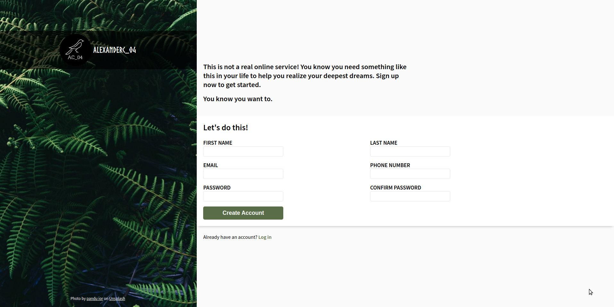

# Sign-Up Form

This is a solution to the [PROJECT: SIGN-UP FORM](https://www.theodinproject.com/paths/full-stack-javascript/courses/intermediate-html-and-css/lessons/sign-up-form)

## Description

This time it’s a sign-up form for an imaginary service.

### Screenshot

#### Desktop

### Links

- Solution URL: (https://github.com/AlexanderC04/sign-up-form.git)
- Live Site URL: (https://alexanderc04.github.io/sign-up-form/)

## Author

- Website - (https://github.com/AlexanderC04)
- Frontend Mentor - (https://www.frontendmentor.io/profile/AlexanderC04)
